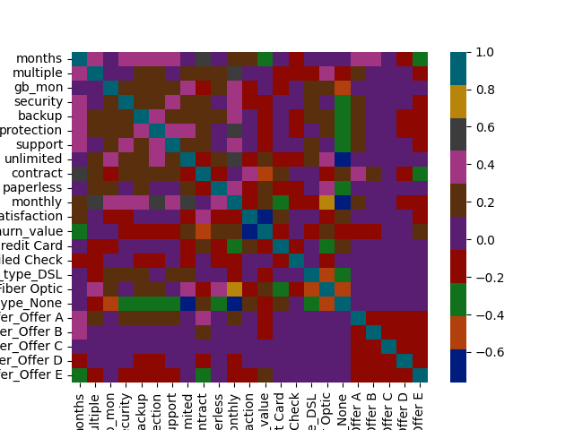
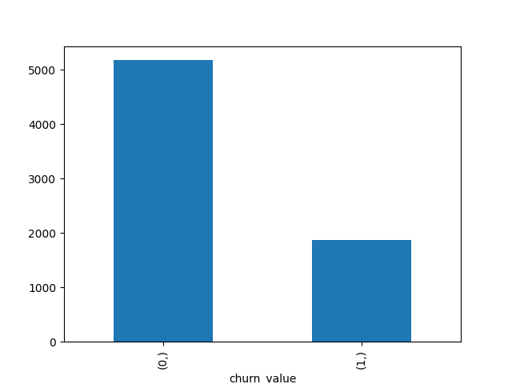

# Customer Churn Prediction and Driver Analysis

## Project Overview

This project applies supervised machine learning techniques to predict customer churn and to analyze the main factors that influence customer attrition. The goal is to support data-driven decision-making for customer retention by identifying high-risk customers and understanding the drivers behind churn.

Three different classification models are trained and compared: Logistic Regression, Random Forest, and AdaBoost. Several resampling strategies are evaluated to handle class imbalance, and models are assessed using standard classification metrics such as accuracy, recall, F1-score, and AUC.

---

## Objectives

- Predict whether a customer will churn based on account, service, billing, and satisfaction data.
- Compare different classification models and sampling strategies.
- Identify the most important drivers of churn.
- Provide actionable insights for business stakeholders.
- Highlight limitations and propose future improvements.

---

## Dataset

The dataset contains customer-level information including:

- Service subscriptions (security, backup, protection, support, unlimited data)
- Account details (contract type, tenure in months)
- Billing information (monthly charges)
- Payment method (credit card, mailed check)
- Internet service type (DSL, Fiber Optic, None)
- Promotional offers (Offer A–E)
- Customer satisfaction indicators  
- Target variable: `churn_value` (0 = no churn, 1 = churn)

The dataset is imbalanced, with significantly more non-churned customers than churned customers.

---

## Models Used

- Logistic Regression (baseline, interpretable)
- Random Forest (nonlinear ensemble)
- AdaBoost (boosting-based classifier)

---

## Evaluation Metrics

- Accuracy
- Precision
- Recall
- F1-score
- ROC AUC

Recall and AUC are emphasized because missing churned customers is costly from a business perspective.

---

## Key Findings

- Customers with shorter tenure and lower satisfaction are more likely to churn.
- Higher monthly charges and fewer service add-ons are associated with increased churn risk.
- Contract structure, internet service type, and promotional offers significantly influence churn behavior.
- Random Forest with undersampling provided the best overall predictive performance.

---

## Visualizations

### Feature Correlations

### Target Distribution

---

## Model Results

The full evaluation results are available here:

| Model               | Sampling | Accuracy | Precision | Recall | F1-score | AUC |
|---------------------|----------|----------|-----------|--------|----------|------|
| Logistic Regression | Normal   | 0.9541   | 0.9504    | 0.8693 | 0.9081   | 0.9267 |
| Logistic Regression | SMOTE    | 0.9470   | 0.8739    | 0.9310 | 0.9016   | 0.9418 |
| Logistic Regression | Over     | 0.9427   | 0.8502    | 0.9474 | 0.8961   | 0.9442 |
| Logistic Regression | Under    | 0.9423   | 0.8522    | 0.9419 | 0.8948   | 0.9422 |
| Random Forest       | Normal   | 0.9536   | 0.9398    | 0.8784 | 0.9081   | 0.9293 |
| Random Forest       | SMOTE    | 0.9531   | 0.9297    | 0.8875 | 0.9081   | 0.9319 |
| Random Forest       | Over     | 0.9517   | 0.9228    | 0.8893 | 0.9057   | 0.9315 |
| Random Forest       | Under    | 0.9446   | 0.8653    | 0.9328 | 0.8978   | 0.9408 |
| AdaBoost            | Normal   | 0.9394   | 0.8867    | 0.8802 | 0.8834   | 0.9203 |
| AdaBoost            | SMOTE    | 0.9252   | 0.8280    | 0.9002 | 0.8626   | 0.9171 |
| AdaBoost            | Over     | 0.9219   | 0.8054    | 0.9238 | 0.8605   | 0.9225 |
| AdaBoost            | Under    | 0.9347   | 0.8482    | 0.9129 | 0.8794   | 0.9276 |

---

## Limitations

- The dataset does not include behavioral data such as customer support interactions or complaints.
- Temporal patterns in churn behavior are not modeled.
- Feature importance and explainability could be improved using tools like SHAP.

---

## Future Work

- Add behavioral and time-series features.
- Perform more extensive hyperparameter tuning.
- Optimize classification thresholds for business objectives.
- Apply model explainability techniques (SHAP, partial dependence).
- Integrate cost-sensitive learning based on business retention costs.

---

## How to Run

1. Clone the repository.
2. Install required dependencies.
3. Open `main.ipynb` and run all cells.

---

Author  
**Aymane El Mandili**  
Computer Science

